# Focus Meditation Agent - MLOps CI/CD Pipeline Project

[/badge.svg)](https://github.com/roshi12/mlops-assignment/actions)
[](https://hub.docker.com/r/bilalrazaswe/focus-meditation-agent)
[](https://www.python.org/downloads/)

## 📋 Assignment Overview

**Course**: Machine Learning Operations (MLOps)  
**Assignment**: CI/CD Pipeline Development  
**Group**: 01  
**Deadline**: September 20, 2025  

This project demonstrates a complete MLOps CI/CD pipeline for a machine learning application that predicts meditation effectiveness based on session duration and initial mood state.

## 🏗️ Architecture Overview

```
┌─────────────────┐    ┌──────────────────┐    ┌─────────────────────┐
│   Developer     │    │   GitHub Repo    │    │   Production        │
│   Local Dev     │───▶│   Branch Strategy│───▶│   Docker Container  │
└─────────────────┘    └──────────────────┘    └─────────────────────┘
                              │
                              ▼
                    ┌──────────────────┐
                    │  CI/CD Pipeline  │
                    │  ┌─────────────┐ │
                    │  │GitHub Actions│ │
                    │  │   flake8     │ │
                    │  │   pytest     │ │
                    │  └─────────────┘ │
                    │  ┌─────────────┐ │
                    │  │  Jenkins    │ │
                    │  │  Docker     │ │
                    │  │  Email      │ │
                    │  └─────────────┘ │
                    └──────────────────┘
```

## 🎯 Key Features

### ✅ Core Requirements Fulfilled
- **Unique Dataset**: Custom meditation sessions dataset for Group 01
- **Machine Learning Model**: Scikit-learn pipeline for mood prediction
- **Flask REST API**: 4 endpoints with comprehensive functionality
- **Docker Containerization**: Multi-stage build with production optimization
- **Docker Hub**: Image published and publicly accessible
- **Kubernetes Deployment**: Production-ready K8s manifests with 3 replicas
- **CI/CD Pipeline**: GitHub Actions + Jenkins integration
- **Branch Strategy**: dev → test → master workflow
- **Admin Approval**: Pull request reviews with CODEOWNERS
- **Automated Testing**: Code quality (flake8) + Unit tests (pytest)
- **Email Notifications**: Jenkins success/failure alerts

### 🚀 Technical Stack
- **Backend**: Python 3.11, Flask, Gunicorn
- **ML Framework**: Scikit-learn, Pandas, Joblib
- **Containerization**: Docker, Docker Hub
- **Orchestration**: Kubernetes (Deployment + Service)
- **CI/CD**: GitHub Actions, Jenkins
- **Testing**: pytest, flake8
- **Database**: CSV dataset (30+ meditation session records)

## 📁 Project Structure

```
mlops-assignment/
├── 📄 app.py                          # Flask REST API application
├── 🐳 Dockerfile                      # Multi-stage container definition
├── 🔧 Jenkinsfile                     # CI/CD pipeline configuration
├── 📋 requirements.txt                # Python dependencies
├── 📊 data/
│   └── group_01/
│       ├── meditation_sessions.csv    # Unique dataset (30+ records)
│       └── README.md                  # Dataset documentation
├── 🤖 model/
│   ├── model.pkl                      # Trained ML model artifact
│   └── train.py                       # Model training script
├── 🧪 tests/
│   └── test_app.py                    # Comprehensive unit tests
├── ☸️ k8s/
│   ├── deployment.yaml                # Kubernetes Deployment manifest
│   ├── service.yaml                   # LoadBalancer Service manifest
│   ├── service-nodeport.yaml          # NodePort Service manifest
│   └── README.md                      # Kubernetes documentation
├── ⚙️ .github/
│   ├── CODEOWNERS                     # Admin approval configuration
│   └── workflows/
│       ├── lint.yml                   # flake8 code quality checks
│       └── test.yml                   # pytest automated testing
├── 📚 docs/                           # Documentation files
│   └── TASK4_DOCKER_KUBERNETES.md     # Task 4 complete guide
├── 🚀 demo-script.ps1                 # Teacher demonstration script
├── 🐳 docker-push.ps1                 # Docker Hub push automation
├── ☸️ k8s-deploy.ps1                  # Kubernetes deployment automation
├── 🧹 k8s-cleanup.ps1                 # Kubernetes cleanup script
├── 📋 TASK4_QUICKREF.md               # Task 4 quick reference
├── 📊 TASK4_WORKFLOW.md               # Task 4 workflow diagrams
├── 📝 TASK4_SUMMARY.md                # Task 4 completion summary
└── 📖 README.md                       # This comprehensive guide
```

## 🔄 CI/CD Pipeline Flow

### 1. Development Workflow

```mermaid
graph LR
    A[Local Development] --> B[Push to dev branch]
    B --> C[GitHub Actions: flake8]
    C --> D[Code Quality Check ✅]
    D --> E[Create PR: dev → test]
    E --> F[GitHub Actions: pytest]
    F --> G[Unit Tests ✅]
    G --> H[Create PR: test → master]
    H --> I[Jenkins Pipeline Trigger]
    I --> J[Docker Build & Push]
    J --> K[Email Notification]
```


### 2. Branch Protection Strategy
- **dev branch**: Direct pushes allowed, triggers lint checks
- **test branch**: Requires PR from dev, triggers unit tests
- **master branch**: Requires PR from test, triggers Jenkins deployment

### 3. Automated Quality Gates
- **Code Quality**: flake8 PEP8 compliance checking
- **Testing**: pytest unit test suite execution
- **Security**: Docker image vulnerability scanning
- **Deployment**: Automated Docker Hub publishing

## 🚀 Quick Start Guide

### Prerequisites
- Python 3.11+
- Docker Desktop
- Git
- Jenkins (optional for full pipeline)

### 1. Clone Repository
```bash
git clone https://github.com/roshi12/mlops-assignment.git
cd mlops-assignment
```

### 2. Setup Python Environment
```bash
# Create virtual environment
python -m venv .venv

# Activate (Windows)
.\.venv\Scripts\Activate.ps1

# Install dependencies
pip install -r requirements.txt
```

### 3. Run Locally
```bash
# Start Flask application
python app.py

# Application runs on http://localhost:5000
```

### 4. Test Endpoints
```bash
# Health check
curl http://localhost:5000/health

# Get meditation sessions
curl http://localhost:5000/sessions

# Get statistics
curl http://localhost:5000/stats

# Predict mood (POST request)
curl -X POST http://localhost:5000/predict \
  -H "Content-Type: application/json" \
  -d '{"duration_minutes": 20, "mood_before": "stressed"}'
```

## 🐳 Docker Deployment

### Build Image
```bash
docker build -t bilalrazaswe/focus-meditation-agent:latest .
```

### Run Container
```bash
docker run -p 5000:5000 bilalrazaswe/focus-meditation-agent:latest
```

### Docker Hub Integration
- **Repository**: `bilalrazaswe/focus-meditation-agent`
- **Automated Builds**: Triggered by Jenkins on master branch changes
- **Tags**: `latest`, version numbers (`v1.0`, `v1.1`, etc.)

## 🧪 Testing

### Run Unit Tests
```bash
# Run all tests with verbose output
python -m pytest tests/ -v

# Run with coverage report
python -m pytest tests/ --cov=app
```

### Code Quality Checks
```bash
# Run flake8 linting
python -m flake8 .

# Check specific files
python -m flake8 app.py tests/
```

### Test Coverage
- **API Endpoints**: 100% covered
- **Model Integration**: Tested with mock data
- **Error Handling**: Edge cases validated
- **Health Checks**: System status monitoring

## 📊 Dataset Information

### Meditation Sessions Dataset (Group 01)
- **Records**: 30+ meditation session entries
- **Features**: 
  - `date`: Session date (YYYY-MM-DD)
  - `duration_minutes`: Session length (10-35 minutes)
  - `mood_before`: Initial mood state (stressed, neutral, anxious, tired)
  - `mood_after`: Post-meditation mood (calm, relaxed, focused, energized)

### Machine Learning Model
- **Algorithm**: Logistic Regression with preprocessing pipeline
- **Preprocessing**: OneHotEncoder for categorical features
- **Features**: `duration_minutes` + `mood_before` → `mood_after`
- **Accuracy**: Validated on training data with cross-validation

## 🔧 Configuration

### Environment Variables
```bash
# Flask configuration
FLASK_ENV=production
FLASK_APP=app.py

# Docker configuration
DOCKERHUB_REPO=bilalrazaswe/focus-meditation-agent
```

### Jenkins Configuration
1. **Credentials**: Set up `dockerhub-creds` in Jenkins
2. **Email**: Configure SMTP settings for notifications
3. **Pipeline**: Points to `Jenkinsfile` in repository root

## 📸 Demonstration Guide

### For Teachers/Evaluators

1. **GitHub Repository**: [https://github.com/roshi12/mlops-assignment](https://github.com/roshi12/mlops-assignment)
2. **GitHub Actions**: Check workflow executions in Actions tab
3. **Docker Hub**: [https://hub.docker.com/r/bilalrazaswe/focus-meditation-agent](https://hub.docker.com/r/bilalrazaswe/focus-meditation-agent)
4. **Live Demo**: Run `powershell -ExecutionPolicy Bypass -File demo-script.ps1`

### Demo Script Execution
```powershell
# Comprehensive demonstration
.\demo-script.ps1

# Quick Docker test
.\docker-push-test.ps1
```

## ☸️ Kubernetes Deployment (Task 4)

### Docker Hub Push
Push the Docker image to Docker Hub registry:

```powershell
# Automated script (recommended)
.\docker-push.ps1

# Manual commands
docker build -t bilalrazaswe/focus-meditation-agent:latest .
docker login
docker push bilalrazaswe/focus-meditation-agent:latest
```

**Docker Hub Repository**: [bilalrazaswe/focus-meditation-agent](https://hub.docker.com/r/bilalrazaswe/focus-meditation-agent)

### Kubernetes Deployment
Deploy the application to a Kubernetes cluster:

```powershell
# Automated deployment (recommended)
.\k8s-deploy.ps1

# Manual deployment
kubectl apply -f k8s/deployment.yaml
kubectl apply -f k8s/service-nodeport.yaml  # For local
# OR
kubectl apply -f k8s/service.yaml           # For cloud

# Check deployment status
kubectl get pods -l app=focus-meditation-agent
kubectl get service
```

### Kubernetes Resources
- **Deployment**: 3 replicas with health checks
- **Service**: NodePort (30080) or LoadBalancer
- **Resource Limits**: CPU 250m-500m, Memory 256Mi-512Mi
- **Health Checks**: Liveness and readiness probes
- **Access**: http://localhost:30080/ (NodePort)

### Kubernetes Management
```powershell
# View logs
kubectl logs -l app=focus-meditation-agent

# Scale replicas
kubectl scale deployment focus-meditation-agent --replicas=5

# Update deployment
kubectl rollout restart deployment/focus-meditation-agent

# Cleanup
.\k8s-cleanup.ps1
```

### Task 4 Documentation
- **Quick Reference**: See [TASK4_QUICKREF.md](TASK4_QUICKREF.md)
- **Complete Guide**: See [docs/TASK4_DOCKER_KUBERNETES.md](docs/TASK4_DOCKER_KUBERNETES.md)
- **Workflow Diagram**: See [TASK4_WORKFLOW.md](TASK4_WORKFLOW.md)
- **K8s Details**: See [k8s/README.md](k8s/README.md)

## 🏆 Assignment Compliance

### Requirements Checklist
- ✅ **CI/CD Pipeline**: GitHub Actions + Jenkins
- ✅ **Unique Dataset**: Group 01 meditation sessions
- ✅ **ML Model**: Trained and integrated
- ✅ **Docker**: Multi-stage build with optimization
- ✅ **Branch Strategy**: dev → test → master
- ✅ **Admin Approval**: CODEOWNERS configuration
- ✅ **Code Quality**: flake8 automation
- ✅ **Unit Testing**: pytest comprehensive suite
- ✅ **Email Notifications**: Jenkins integration
- ✅ **Documentation**: Complete technical documentation

## 🚨 Troubleshooting

### Common Issues
1. **Docker Desktop not running**: Start Docker Desktop application
2. **Jenkins not accessible**: Check port 8080 availability
3. **Python environment issues**: Recreate virtual environment
4. **GitHub Actions failing**: Check workflow logs in Actions tab
5. **Docker Hub push fails**: Verify login credentials

### Debug Commands
```bash
# Check Docker status
docker info

# Verify Python environment
python --version
pip list

# Test Flask app manually
python -c "from app import app; print('App imported successfully')"

# Check GitHub Actions
git log --oneline -5  # Recent commits that should trigger workflows
```

## 📞 Support & Contact

- **Repository Issues**: [GitHub Issues](https://github.com/roshi12/mlops-assignment/issues)
- **Documentation**: See `docs/` directory for detailed guides
- **Demo Videos**: Available in submission package

## 📄 License

This project is developed for educational purposes as part of the MLOps course assignment.

---

**🎯 Assignment Status: 100% Complete** ✅  
**Last Updated**: September 20, 2025  
**Version**: 1.0.0
